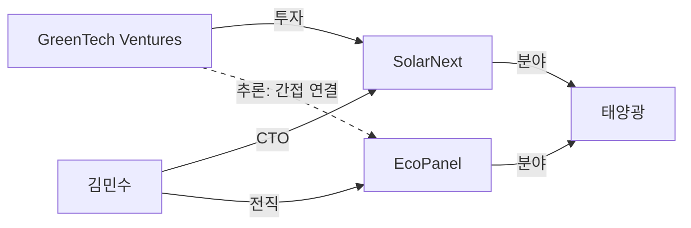
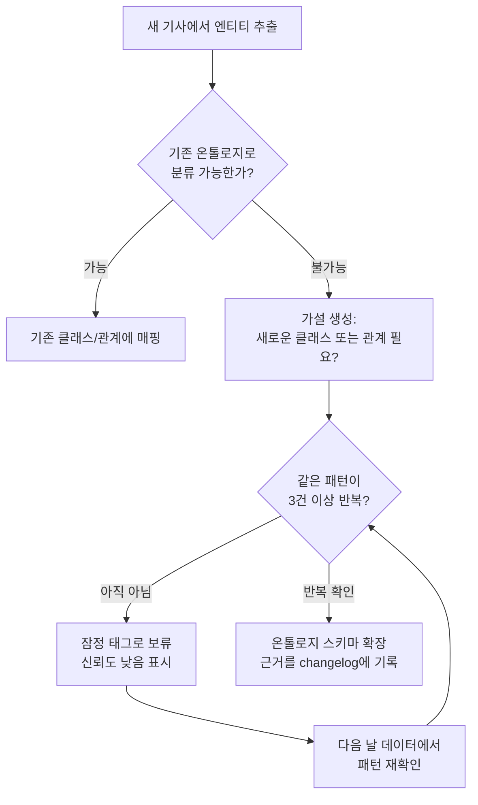
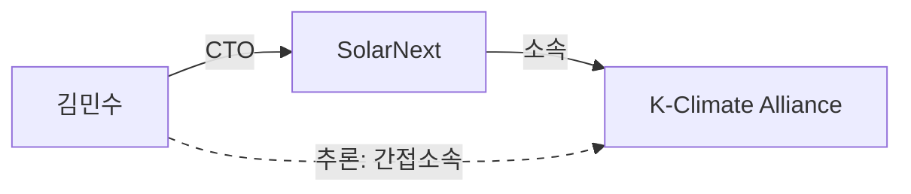
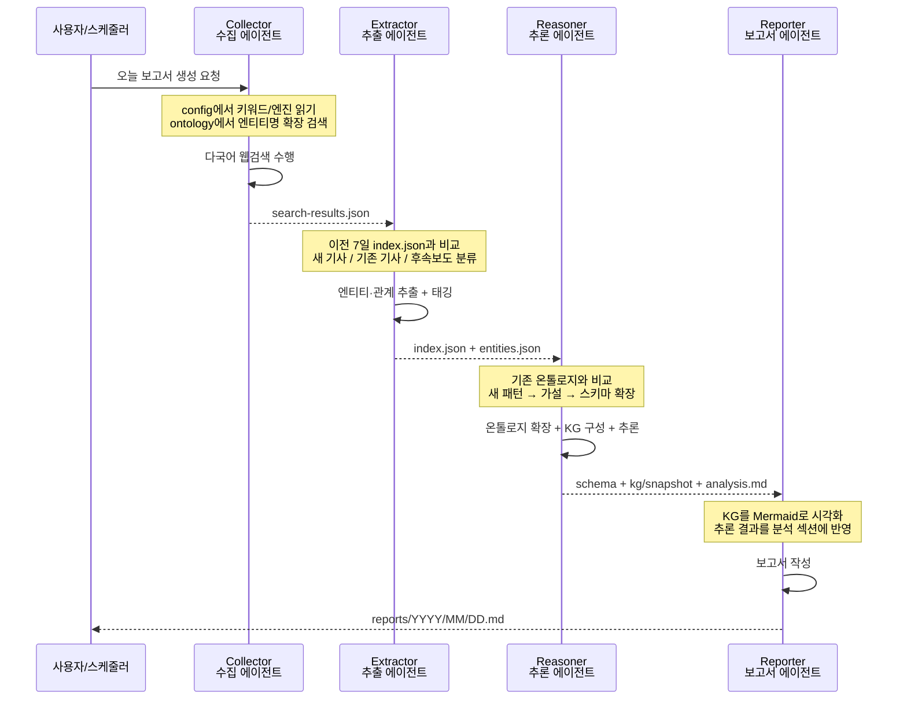

# Onto-OSINT — Ontology-Based OSINT Report System

설정 파일 하나만 수정하면 어떤 주제든 자동 OSINT 모니터링이 가능한 범용 시스템.
GitHub Actions 또는 로컬 Claude Code CLI로 실행되며, 온톨로지를 진화시키고 지식그래프를 구축하여 보고서를 생성한다.

---

## 1. 이 시스템이 해결하는 문제

### OSINT란?

OSINT(Open Source Intelligence)는 공개된 정보 — 뉴스, 논문, SNS, 정부 발표, 블로그 — 에서 의미 있는 정보를 수집하고 분석하는 활동이다. 기자, 연구자, 정책 분석가, 투자자 등이 매일 하는 일이지만, 수작업에는 한계가 있다:

| 문제 | 설명 | 예시 |
|------|------|------|
| **정보의 홍수** | 매일 수백 건의 기사 중 새 정보와 중복을 구분하기 어렵다 | "이 기사는 어제 본 것과 같은 내용인가, 새로운 정보가 추가된 것인가?" |
| **점과 점의 연결** | 개별 기사는 단편적이지만, 연결하면 큰 그림이 보인다 | "A 기업이 B 기술에 투자했고, C 연구소가 같은 기술을 발표했다 — 이 둘은 관련이 있을까?" |
| **시간에 따른 변화** | 며칠에 걸친 사건의 흐름을 놓치기 쉽다 | "지난주 발표된 정책이 이번 주 시장에 어떤 영향을 미쳤는지" |

이 시스템은 이 세 가지 문제를 자동화한다.

---

## 2. 왜 단순 검색이 아니라 "온톨로지"인가?

### 키워드 검색의 한계

일반적인 뉴스 모니터링 도구는 키워드로 검색해서 결과를 나열한다. 예를 들어 "기후기술 스타트업"을 검색하면 관련 기사 100건이 나온다. 하지만 이것만으로는 다음 질문에 답할 수 없다:

- 어떤 투자자가 어떤 스타트업에 투자하고 있는가?
- 특정 기술을 개발하는 스타트업들 사이에 인적 네트워크가 있는가?
- 정부 정책 변화가 어떤 스타트업에 영향을 미치는가?

### 온톨로지가 해결하는 것

**온톨로지(Ontology)**는 "세상의 지식을 구조화하는 틀"이다.

도서관을 생각해보자. 책이 아무렇게나 쌓여있으면 원하는 책을 찾기 어렵다. 하지만 "문학 > 소설 > 한국소설"처럼 분류 체계가 있으면 구조적으로 찾을 수 있다. 온톨로지는 정보 세계의 분류 체계다.

이 시스템에서 온톨로지는 두 가지를 정의한다:

**엔티티 유형** — 세상에 존재하는 것들의 분류:

```
Entity (엔티티)
├── Person (인물)      — 이름, 역할, 소속
├── Organization (조직) — 이름, 유형, 소재지
├── Event (사건)       — 이름, 날짜, 장소
├── Location (장소)    — 이름, 유형
└── Concept (개념)     — 이름, 도메인
```

**관계 유형** — 엔티티 사이의 연결:

```
소속(affiliatedWith):   인물 → 조직
참여(participatesIn):   인물 → 사건
협력(cooperatesWith):   조직 → 조직
대립(opposes):          조직 → 조직
원인(causedBy):         사건 → 사건
후속(follows):          사건 → 사건
```

### 키워드 검색 vs 온톨로지 OSINT

같은 기사를 두 방식으로 처리하면 이런 차이가 난다:

```
기사: "GreenTech Ventures가 태양광 스타트업 SolarNext에 5억 원 투자"

키워드 검색 결과:
  → "기후기술 스타트업" 검색 결과 중 하나로 나열됨. 끝.

온톨로지 OSINT 결과:
  → 엔티티 추출: GreenTech Ventures(투자사), SolarNext(스타트업)
  → 관계 추출: GreenTech Ventures --투자--> SolarNext
  → 기존 지식과 연결: SolarNext의 CTO가 이전에 EcoPanel 출신이라는 
     지난주 기사와 연결
  → 추론: GreenTech Ventures와 EcoPanel 사이에 간접적 관계 가능성 발견
```

---

## 3. 지식그래프 — 축적될수록 강력해지는 정보 네트워크

**지식그래프(Knowledge Graph)**는 온톨로지로 구조화된 정보를 네트워크로 표현한 것이다. 각 정보 조각을 **(주어, 관계, 목적어)** 형태의 **트리플(triple)**로 저장한다.

```
트리플 예시:
  (SolarNext,  소속분야,  태양광)
  (김민수,      CTO,      SolarNext)
  (김민수,      전직,      EcoPanel)
  (GreenTech,  투자,      SolarNext)
```

이 트리플들이 모이면 그래프가 된다:



그래프는 시간이 지날수록 가치가 커진다:

| 시점 | 노드 수 | 관계 수 | 무엇이 보이는가 |
|------|---------|---------|----------------|
| 1일차 | 5개 | 3개 | 개별 사실 |
| 7일차 | 25개 | 40개 | 주요 행위자 간 관계 |
| 30일차 | 80개 | 200개 | 네트워크 구조, 핵심 허브 |
| 90일차 | 200개 | 600개 | 시간에 따른 패턴, 트렌드 변화 |

이것이 단발성 검색과 근본적으로 다른 점이다. **매일 조금씩 쌓인 정보가 어느 순간 사람이 머릿속으로 파악할 수 없는 복잡한 관계망을 보여준다.**

---

## 4. 온톨로지 확장 — 가설 기반의 점진적 진화

온톨로지는 "처음에 모든 것을 정의해놓고 끝"이 아니다. 새로운 정보가 들어올 때마다 **가설을 세우고 검증하는 방식**으로 진화한다.

### 확장이 일어나는 순간

기존 온톨로지로 분류할 수 없는 새로운 정보가 등장했을 때 확장이 발생한다:



### 구체적 예시: "기후기술 스타트업 생태계" 추적

**1일차 — 시드 온톨로지 (초기 설정):**

```
클래스: Person, Organization, Event, Location, Concept
관계: affiliatedWith, participatesIn, locatedIn, relatedTo
```

**3일차 — 첫 번째 가설:**

여러 기사에서 "투자"라는 행위가 반복적으로 등장하지만, 기존 관계(`relatedTo`)로는 "투자"와 "협력"을 구분할 수 없다.

```
가설: "investsIn" 관계 유형이 필요하다
근거: 3건의 기사에서 투자 관계 패턴 확인
  - src-012: "GreenTech, SolarNext에 투자"
  - src-015: "BlueWave Capital, AquaClean에 투자"  
  - src-018: "EcoFund, CarbonCapture에 투자"
판정: 3건 이상 반복 → 스키마에 "investsIn" 관계 추가
```

**7일차 — 두 번째 가설:**

Organization 클래스 하나로는 "스타트업"과 "투자사"와 "연구소"를 구분할 수 없다는 문제가 발견된다.

```
가설: Organization의 하위 클래스가 필요하다
  - Startup (스타트업): 기술 개발, 투자 유치 대상
  - Investor (투자사): 투자 실행 주체
  - ResearchLab (연구소): 기술 연구, 논문 발표
근거: 각 유형별 5건 이상 반복 확인
판정: 스키마에 3개 하위 클래스 추가
```

**30일차 — 안정화:**

초기 진화가 빠르게 일어나고, 시간이 지나면서 새로운 클래스/관계 추가가 줄어든다. 대신 기존 인스턴스의 정보가 풍부해진다.

### 확장의 안전장치

무분별한 확장을 막기 위해 다음 제한이 있다:

| 제한 | 기본값 | 이유 |
|------|--------|------|
| 하루 최대 새 클래스 | 5개 | 급격한 구조 변화 방지 |
| 하루 최대 새 관계 유형 | 10개 | 관계 유형 폭발 방지 |
| 최소 반복 횟수 | 3건 | 한 번의 예외를 일반화하지 않음 |
| 신뢰도 임계값 | 0.7 | 확실하지 않은 확장은 "잠정"으로 표시 |

**핵심 원리: 온톨로지 확장은 "데이터가 요구할 때"만 일어난다. 미리 예측해서 만들어두지 않는다.**

---

## 5. 온톨로지 추론 — 기사에 없는 관계를 논리적으로 발견

추론은 이 시스템의 가장 강력한 기능이다. 어떤 기사에도 직접 나오지 않았지만, 기존 지식을 조합하면 논리적으로 도출할 수 있는 관계를 자동으로 발견한다.

### 추론 규칙 1: 전이성(Transitivity)

> "A가 B에 속하고, B가 C에 속하면, A는 C에도 간접적으로 속한다"

```
알려진 사실:
  (김민수, CTO, SolarNext)
  (SolarNext, 소속, K-Climate Alliance)

추론 결과:
  (김민수, 간접소속, K-Climate Alliance)
  신뢰도: 0.81 (= 0.9 × 0.9)
```



왜 유용한가? 기자가 "김민수"를 취재하면서 K-Climate Alliance와의 연결을 모르고 있었다면, 이 추론이 새로운 취재 방향을 열어줄 수 있다.

### 추론 규칙 2: 사건 체인(Event Chain)

> "사건 A가 사건 B를 유발하고, B가 C를 유발하면, A→C 인과 체인이 존재한다"

```
알려진 사실:
  (EU 탄소국경세 시행, 원인, 아시아 탄소크레딧 수요 급증)
  (아시아 탄소크레딧 수요 급증, 원인, 한국 탄소포집 스타트업 투자 활성화)

추론 결과:
  (EU 탄소국경세 시행, 인과체인, 한국 탄소포집 스타트업 투자 활성화)
  신뢰도: 0.64 (= 0.8 × 0.8, 2단계 체인 감쇠)
```

### 추론 규칙 3: 공동 참여(Co-participation)

> "같은 사건에 참여한 엔티티는 잠재적 관계가 있다"

```
알려진 사실:
  (GreenTech Ventures, 참여, 2026 기후기술 서밋)
  (SolarNext, 참여, 2026 기후기술 서밋)
  (EcoFund, 참여, 2026 기후기술 서밋)

추론 결과:
  (GreenTech, 잠재적관계, SolarNext)   신뢰도: 0.5
  (GreenTech, 잠재적관계, EcoFund)     신뢰도: 0.5
  (SolarNext, 잠재적관계, EcoFund)     신뢰도: 0.5
```

공동 참여 추론은 신뢰도가 낮다 — 같은 행사에 참석했다고 반드시 관계가 있는 것은 아니다. 하지만 다른 증거와 결합되면 신뢰도가 올라간다. 예를 들어 공동 참여 + 다른 기사에서 협업 언급이 있으면 "잠재적 관계"가 "협력 관계"로 승격된다.

### 신뢰도 계산

추론의 신뢰도는 입력 트리플의 신뢰도를 곱하여 계산한다:

```
추론 신뢰도 = 입력 트리플1 신뢰도 × 입력 트리플2 신뢰도 × 규칙 가중치

예: 0.9 × 0.9 × 1.0 = 0.81

추론 체인이 3단계 이상이면 0.5배 감쇠:
예: 0.9 × 0.9 × 0.9 × 0.5 = 0.36 → "잠정" 표시
```

추론 결과는 보고서에 반드시 신뢰도와 근거와 함께 표시되어, 분석가가 검증할 수 있다.

---

## 6. 에이전트 — 각자의 전문 분야가 있는 AI 작업자들

이 시스템은 하나의 거대한 프로그램이 아니라, **4명의 전문 에이전트**가 역할을 나누어 순차적으로 작업한다.

### 에이전트란?

에이전트(Agent)는 특정 역할에 특화된 AI 작업자다. 각 에이전트는 자신만의 역할 정의서(`.claude/agents/`)와 참조 스킬(`.claude/skills/references/`)을 읽고 작업한다. 사람으로 비유하면 팀의 각 구성원과 같다.

### 왜 하나로 합치지 않는가?

하나의 AI에게 "검색하고, 추출하고, 분석하고, 보고서 써"라고 시키면 되지 않을까? 분리하는 데는 네 가지 이유가 있다:

**1. 전문성 (Focus)**
모든 규칙을 한꺼번에 주면 주의가 분산된다. 검색 에이전트는 "어떤 키워드로, 어떤 엔진에서, 어떤 언어로 검색할 것인가"에만 집중한다. 분석 에이전트는 "어떤 엔티티가 있고, 어떤 관계가 있고, 어떤 추론이 가능한가"에만 집중한다.

**2. 추적 가능성 (Traceability)**
각 단계의 산출물이 파일로 저장된다. 보고서에 이상한 결론이 있으면, 어느 단계에서 잘못됐는지 파일을 열어 역추적할 수 있다. "검색 결과는 맞는데 태깅에서 놓친 것인가?" 같은 디버깅이 가능하다.

**3. 교체 가능성 (Modularity)**
검색 방법만 바꾸고 싶으면 collector 에이전트만 수정하면 된다. 보고서 형식만 바꾸고 싶으면 reporter 에이전트만 수정하면 된다. 전체를 다시 만들 필요가 없다.

**4. 에러 격리 (Fault Isolation)**
검색이 실패해도 빈 결과로 다음 단계가 진행된다. 하나의 프로그램이었다면 전체가 멈출 수 있다.

### 4명의 에이전트와 역할



#### Collector (수집 에이전트) — "취재 기자"

**하는 일:** 여러 나라, 여러 매체에서 관련 기사를 검색하고 수집한다.

- `config/osint-config.json`에서 검색 엔진, 키워드, 언어 목록을 읽는다
- WebSearch(빌트인)와 Cheliped Browser(CLI)로 다국어 검색을 수행한다
- `ontology/instances.json`에서 최근 주요 엔티티명을 키워드로 추가한다 (온톨로지 기반 확장 검색)
- 수집한 모든 결과를 `search-results.json`에 구조화하여 저장한다

**비유:** 매일 아침 여러 나라 신문을 훑어보고 "이 주제에 관련된 기사"를 모두 오려서 정리하는 기자.

#### Extractor (추출 에이전트) — "편집 데스크"

**하는 일:** 수집된 기사에서 핵심 정보를 추출하고, 이미 본 기사와 새 기사를 구분한다.

- 각 기사에서 인물, 조직, 사건, 장소 등 엔티티를 추출한다
- 엔티티 간 관계(누가 어디 소속, 누가 무엇에 참여)를 식별한다
- 이전 7일의 기사와 비교하여 태그를 부여한다:
  - `new` — 완전히 새로운 기사
  - `reported` — 이미 보고된 내용
  - `update` — 기존 사건의 후속보도 (새로운 정보가 추가됨)

**비유:** 기자가 가져온 기사를 읽고 "이건 새 소식, 이건 어제 봤던 거, 이건 후속보도"로 분류하는 편집장.

#### Reasoner (추론 에이전트) — "분석관"

**하는 일:** 추출된 정보로 온톨로지를 업데이트하고, 지식그래프를 구성하며, 숨겨진 관계를 추론한다.

- 새로운 엔티티를 `ontology/instances.json`에 등록한다
- 기존 분류로 안 되는 패턴이 반복되면 스키마를 확장한다 (가설 기반)
- 엔티티와 관계를 트리플로 변환하여 `kg/`에 저장한다
- 추론 규칙(전이성, 사건체인, 공동참여)을 적용하여 암시적 관계를 발견한다
- 모든 추론 결과를 근거와 신뢰도와 함께 기록한다

**비유:** 여러 파편 정보를 칠판에 붙여놓고 선으로 연결하며 "이것과 저것은 이런 관계가 있지 않을까?"라고 가설을 세우는 분석관.

#### Reporter (보고서 에이전트) — "보고서 작성자"

**하는 일:** 모든 분석 결과를 종합하여 읽기 쉬운 보고서로 작성한다.

- `report-basis.md`의 포함/제외 결정을 따라 뉴스를 구성한다
- `analysis.md`의 연관관계로 추적 항목을 표시한다
- 지식그래프를 Mermaid 다이어그램으로 시각화하여 보고서에 포함한다
- 추론 결과를 신뢰도와 함께 분석 섹션에 반영한다

**비유:** 분석관의 브리핑을 듣고, 지도와 차트를 포함한 깔끔한 보고서를 만드는 작성자.

### 에이전트 간 데이터 흐름

모든 데이터는 **파일**로 전달된다. 이전 에이전트가 파일을 쓰고, 다음 에이전트가 읽는다.

```
sources/2026-04-07/
├── search-results.json   ← Collector가 작성 (이후 읽지 않음, 추적용)
├── index.json            ← Extractor가 작성 (경량 인덱스)
├── items/src-001.json    ← Extractor가 작성 (개별 기사 상세)
├── entities.json         ← Extractor가 작성 (추출된 엔티티/관계)
├── analysis.md           ← Reasoner가 작성 (분석 결과)
└── report-basis.md       ← Reasoner가 작성 (보고서 포함/제외 근거)

ontology/
├── schema.json           ← Reasoner가 업데이트 (스키마 확장)
├── instances.json        ← Reasoner가 업데이트 (새 엔티티 등록)
└── kg/2026-04-07.json    ← Reasoner가 작성 (일별 KG 스냅샷)

reports/2026/04/
└── 2026-04-07.md         ← Reporter가 작성 (최종 보고서)
```

모든 중간 결과가 파일로 남기 때문에, "왜 이 결론이 나왔는지" 전 과정을 역추적할 수 있다.

---

## 7. 실행 방법 — GitHub Actions 또는 로컬

이 시스템은 두 가지 방식으로 실행할 수 있다. 동일한 에이전트/스킬 파일을 사용한다.

### 방법 1: GitHub Actions (자동 실행)

**적합한 경우:** 매일 정해진 시간에 자동으로 보고서를 받고 싶을 때.

**장점:**
- 서버가 필요 없다 — GitHub가 제공하는 무료 컴퓨팅 자원 사용
- cron 스케줄로 매일 자동 실행 (사람이 버튼을 누를 필요 없음)
- 보고서와 온톨로지가 Git으로 버전 관리됨
- Wiki에 자동 발행되어 팀원과 공유 가능

**설정 방법:**

1. 이 리포지토리를 **Fork**한다
2. `config/osint-config.json`을 수정한다 (아래 "설정 가이드" 참조)
3. GitHub Settings → Secrets에 `CLAUDE_CODE_OAUTH_TOKEN`을 추가한다
4. `.github/workflows/daily-osint-report.yml`의 cron 시간을 확인한다 (기본: KST 08:00)
5. Actions 탭에서 "Daily OSINT Report" → "Run workflow"로 수동 테스트

**수동 실행 (특정 날짜):**

Actions → "Run workflow" → `target_date`에 `2026-04-07` 입력

### 방법 2: 로컬 Claude Code CLI (수동 실행)

**적합한 경우:** 테스트, 디버깅, 또는 필요할 때만 수동으로 실행하고 싶을 때.

**장점:**
- 결과를 바로 확인하고 수정할 수 있다
- 파이프라인 중간에 멈추고 특정 단계만 재실행 가능
- GitHub Secrets 설정 없이 로컬에서 바로 실행

**실행 방법:**

```bash
# 프로젝트 디렉토리로 이동
cd onto-osint

# Claude Code CLI로 실행
claude "오늘 날짜로 OSINT 보고서를 생성해줘"
```

Claude Code는 `CLAUDE.md`를 읽고 프로젝트 규칙을 파악한 후, `.claude/skills/onto-osint-report/skill.md` 오케스트레이터를 따라 6단계 파이프라인을 실행한다.

**특정 단계만 실행:**

```bash
# Phase 1(수집)만 재실행
claude "sources/2026-04-07의 검색 결과를 다시 수집해줘"

# Phase 3-4(온톨로지+그래프)만 재실행
claude "entities.json을 기반으로 온톨로지를 업데이트하고 KG를 재구성해줘"
```

**Cheliped Browser 설정 (로컬):**

Cheliped Browser는 검색 엔진과 커스텀 사이트에서 직접 검색할 때 사용하는 도구다. 로컬 실행 시 먼저 설치한다:

```bash
git clone https://github.com/tykimos/cheliped-browser.git /tmp/cheliped-browser
cd /tmp/cheliped-browser/scripts && npm install
export CHELIPED_CLI=/tmp/cheliped-browser/scripts/cheliped-cli.mjs
```

---

## 8. Fork-and-Configure — 설정 하나로 새 주제 적용

이 시스템의 핵심 설계 철학: **"코드를 수정하지 않고 설정만 바꾸면 새로운 주제에 적용할 수 있다."**

```
원본 (onto-osint)
    │
    ├── Fork A: "기후기술 스타트업" ← config만 수정
    ├── Fork B: "반도체 공급망"     ← config만 수정
    ├── Fork C: "AI 안전성 연구"   ← config만 수정
    └── Fork D: "우주산업 동향"     ← config만 수정
```

각 Fork는 독립적으로 매일 실행되며, 자신만의 온톨로지를 진화시키고, 자신만의 지식그래프를 축적한다.

### 실제 활용 사례

| 프로젝트 | 주제 | 설명 | 링크 |
|----------|------|------|------|
| onto-osint4nknc | 북한 핵활동 모니터링 | 15개 도메인 엔티티 클래스, 20개 관계 유형, 6개 추론 규칙, 한/영 다국어 검색으로 북한 핵/미사일 동향을 추적 | [GitHub](https://github.com/aifactory-team/onto-osint4north-korean-nuclear-activities) |

### 설정 가이드

수정할 파일은 `config/osint-config.json` **단 하나**다:

```jsonc
{
  "project": {
    "topic": "기후기술 스타트업 생태계",    // 추적할 주제
    "goals": [
      "주요 투자 동향 모니터링",
      "핵심 행위자 관계 추적",
      "정책 변화가 시장에 미치는 영향 감지"
    ],
    "scope": {
      "include": ["기후기술", "탄소중립", "cleantech"],
      "exclude": ["석유", "석탄", "화석연료 투자"]
    },
    "report_language": "ko",
    "lookback_days": 7                      // 이전 몇 일과 비교할 것인가
  },
  "search": {
    "keywords": {
      "ko": ["기후기술 스타트업", "탄소중립 투자", "클린테크"],
      "en": ["climate tech startup", "cleantech investment"]
    }
  },
  "ontology": {
    "seed_classes": [
      // 도메인에 맞는 엔티티 유형 정의
      { "id": "Startup", "label": "스타트업", "properties": ["name", "sector", "stage"] },
      { "id": "Investor", "label": "투자사", "properties": ["name", "type", "portfolio"] }
    ],
    "seed_relations": [
      // 도메인에 맞는 관계 유형 정의
      { "id": "investsIn", "label": "투자", "domain": "Investor", "range": "Startup" },
      { "id": "developstech", "label": "기술개발", "domain": "Startup", "range": "Concept" }
    ],
    "reasoning_rules": [
      // 도메인에 맞는 추론 규칙 정의
      {
        "id": "portfolio_overlap",
        "description": "같은 투자사의 포트폴리오 기업들은 잠재적 협력 관계",
        "pattern": "(?investor investsIn ?a) AND (?investor investsIn ?b) => (?a potentialPartner ?b)"
      }
    ]
  }
}
```

---

## 9. 핵심 기능 요약

| 기능 | 설명 |
|------|------|
| **설정 기반 범용성** | `config/osint-config.json` 하나로 주제/키워드/검색엔진/온톨로지 시드 설정 |
| **온톨로지 진화** | 새 정보가 올 때 가설을 세우고 패턴이 반복되면 스키마를 확장 |
| **지식그래프** | 엔티티 간 관계를 트리플로 축적하고 Mermaid로 시각화 |
| **온톨로지 추론** | 전이성, 사건체인, 공동참여 규칙으로 암시적 관계를 발견 |
| **기사 추적** | 이전 7일 보고서와 교차 비교하여 후속 보도를 추적 |
| **이중 실행** | GitHub Actions(자동) 또는 로컬 Claude Code CLI(수동) |
| **Fork-and-Configure** | 설정 하나만 바꾸면 새 주제에 적용 |

---

## 10. 디렉토리 구조

```
onto-osint/
├── config/
│   └── osint-config.json          # 유일한 설정 파일 (fork 후 이것만 수정)
├── ontology/
│   ├── schema.json                # 온톨로지 스키마 (자동 진화)
│   ├── instances.json             # 엔티티 인스턴스 (자동 축적)
│   ├── kg/
│   │   ├── YYYY-MM-DD.json        # 일별 KG 스냅샷
│   │   └── cumulative.json        # 누적 KG
│   └── reasoning-log.md           # 추론 로그
├── sources/YYYY-MM-DD/            # 파이프라인 중간 산출물
│   ├── search-results.json
│   ├── index.json
│   ├── items/src-XXX.json
│   ├── entities.json
│   ├── analysis.md
│   └── report-basis.md
├── reports/YYYY/MM/               # 최종 보고서
│   └── YYYY-MM-DD.md
├── .claude/
│   ├── agents/                    # 에이전트 역할 정의
│   └── skills/onto-osint-report/  # 오케스트레이터 + 참조 스킬
├── .github/workflows/
│   └── daily-osint-report.yml     # GitHub Actions 워크플로우
├── CLAUDE.md                      # 프로젝트 규칙
└── README.md
```

## 라이선스

MIT
