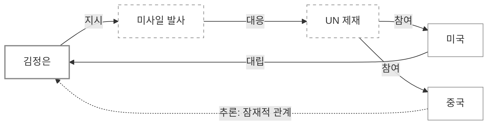

# Onto-OSINT — Ontology-Based OSINT Report System

설정 파일 하나만 수정하면 어떤 주제든 자동 OSINT 모니터링이 가능한 범용 시스템.
GitHub Actions로 매일 자동 실행되며, 온톨로지를 진화시키고 지식그래프를 구축하여 보고서를 생성한다.

---

## 왜 이 시스템이 필요한가?

### OSINT란?

OSINT(Open Source Intelligence)는 공개된 정보원 — 뉴스, 논문, SNS, 정부 발표 등 — 에서 의미 있는 정보를 수집하고 분석하는 활동이다. 기자, 연구자, 정책 분석가, 보안 전문가 등 다양한 사람들이 매일 수행하는 작업이지만, 수작업으로 하면 몇 가지 한계에 부딪힌다:

- **정보의 홍수**: 매일 수백 건의 기사가 쏟아지는데, 어떤 것이 새로운 정보이고 어떤 것이 이미 본 내용인지 구분하기 어렵다
- **점과 점의 연결**: 개별 기사는 단편적이지만, 여러 기사를 연결하면 큰 그림이 보인다. 그러나 사람이 수백 건의 기사를 머릿속에서 연결하기는 어렵다
- **시간에 따른 변화 추적**: "지난주에 A가 B를 만났고, 이번 주에 B가 C와 합의했다"는 흐름을 놓치기 쉽다

이 시스템은 이 세 가지 문제를 자동화한다.

### 왜 단순 검색이 아니라 "온톨로지"인가?

일반적인 뉴스 모니터링 도구는 키워드로 검색해서 결과를 나열한다. 이것만으로는 부족한 이유가 있다.

**키워드 검색의 한계:**
"북한 미사일"로 검색하면 미사일 관련 기사는 나오지만, 그 미사일을 만든 조직, 발사 결정에 관여한 인물, 이에 대응한 국가, 적용된 제재 — 이런 **관계**는 보이지 않는다.

**온톨로지가 해결하는 것:**
온톨로지(Ontology)는 "세상의 지식을 구조화하는 틀"이다. 쉽게 말하면:

```
키워드 검색:  "북한 미사일" → 기사 100건 나열
온톨로지 OSINT: "북한 미사일" → 누가 만들었고, 누가 발사했고, 누가 대응했고, 
                어떤 제재가 있었고, 이전 사건과 어떻게 연결되는지
```

온톨로지는 **엔티티**(인물, 조직, 사건, 장소)와 **관계**(소속, 참여, 대립, 협력)를 정의한다.
이 틀로 기사를 분석하면 단순 키워드 매칭이 아니라 **의미 있는 정보 구조**가 만들어진다.

### 왜 지식그래프인가?

지식그래프(Knowledge Graph)는 온톨로지로 구조화된 정보를 시각적으로 표현한 것이다.



이 그래프가 매일 자동으로 축적되면:
- **1일차**: 노드 5개, 관계 3개
- **30일차**: 노드 50개, 관계 120개 — 사람이 머릿속으로 정리할 수 없는 복잡한 관계망
- **90일차**: 시간 흐름에 따른 패턴이 보이기 시작한다

그래프는 시간이 지날수록 가치가 커진다. 이것이 단발성 검색과 근본적으로 다른 점이다.

### 왜 "추론"이 중요한가?

온톨로지 추론은 명시적으로 기사에 나오지 않은 관계를 논리적으로 발견하는 것이다.

**예시:**
- 기사 A: "김모씨가 X조직에 소속되어 있다"
- 기사 B: "X조직이 Y연합의 산하 기관이다"
- **추론**: "김모씨는 Y연합에 간접적으로 소속되어 있다" ← 어떤 기사에도 직접 나오지 않은 정보

이런 추론이 매일 자동으로 수행되면, 사람이 놓치기 쉬운 간접적 연결고리를 시스템이 발견해준다.
추론된 관계는 신뢰도 점수와 함께 보고서에 표시되어 분석가가 검증할 수 있다.

---

## 왜 멀티 에이전트 구조인가?

이 시스템은 하나의 거대한 프로그램이 아니라, 4명의 **전문 에이전트**가 역할을 나누어 순차적으로 작업한다.

### 에이전트란?

에이전트는 특정 역할에 특화된 AI 작업자다. 사람으로 비유하면:

| 에이전트 | 비유 | 하는 일 |
|----------|------|---------|
| **Collector** | 취재 기자 | 여러 나라, 여러 매체에서 관련 기사를 검색하고 수집 |
| **Extractor** | 편집 데스크 | 수집된 기사에서 핵심 인물/조직/사건을 추출하고, 이미 본 기사와 새 기사를 구분 |
| **Reasoner** | 분석관 | 추출된 정보로 지식 체계를 업데이트하고, 숨겨진 관계를 추론 |
| **Reporter** | 보고서 작성자 | 모든 분석 결과를 종합하여 읽기 쉬운 보고서로 작성 |

### 왜 하나로 합치지 않는가?

하나의 AI에게 "검색하고, 추출하고, 분석하고, 보고서 써"라고 시키면 되지 않을까?

**분리하는 이유:**

1. **전문성**: 각 에이전트가 자기 역할의 규칙만 읽으므로, 검색 에이전트는 검색에 집중하고 분석 에이전트는 분석에 집중한다. 모든 규칙을 한꺼번에 주면 품질이 떨어진다.

2. **추적 가능성**: 각 단계의 산출물이 파일로 저장된다. 보고서에 문제가 있으면 "어느 단계에서 잘못됐는지" 파일을 열어 역추적할 수 있다. 하나의 블랙박스에서는 이것이 불가능하다.

3. **재사용성**: 검색 에이전트만 교체하거나, 보고서 형식만 바꾸는 것이 가능하다. 전체를 다시 만들 필요가 없다.

4. **에러 격리**: 검색이 실패해도 빈 결과로 다음 단계가 진행된다. 하나의 프로그램이었다면 전체가 멈출 수 있다.

### 파이프라인 데이터 흐름

각 에이전트는 이전 에이전트가 만든 **파일**을 읽고, 자신의 결과를 **파일**로 저장한다.
모든 중간 결과가 파일로 남기 때문에, 나중에 "왜 이 결론이 나왔는지" 전 과정을 추적할 수 있다.

```
Collector          Extractor           Reasoner           Reporter
   │                  │                   │                  │
   │ search-          │ index.json        │ schema.json      │ report.md
   │ results.json     │ entities.json     │ kg/snapshot.json │ (KG 시각화 포함)
   │                  │ items/            │ analysis.md      │
   ▼                  ▼                   ▼                  ▼
[sources/YYYY-MM-DD/] ──────────────────────────────────── [reports/YYYY/MM/]
                      [ontology/] ← 매일 진화
```

---

## 왜 GitHub Actions인가?

이 시스템은 사용자의 컴퓨터에서 실행되는 것이 아니라, GitHub의 서버에서 매일 자동으로 실행된다.

**장점:**
- **서버 불필요**: 별도의 서버를 구축하거나 관리할 필요가 없다. GitHub가 제공하는 무료 컴퓨팅 자원을 사용한다.
- **자동 스케줄**: cron 스케줄로 매일 정해진 시간에 실행된다. 사람이 매일 버튼을 누를 필요가 없다.
- **버전 관리**: 보고서와 온톨로지가 Git으로 관리되어, 모든 변경 이력이 남는다. "30일 전의 온톨로지"로 되돌아갈 수도 있다.
- **Fork = 복제**: GitHub의 Fork 기능으로 이 시스템 전체를 한 번에 복제하고, 설정만 바꾸면 새로운 주제의 OSINT 시스템이 된다.

---

## Fork-and-Configure 설계 철학

이 시스템은 **"코드를 수정하지 않고 설정만 바꾸면 새로운 주제에 적용할 수 있다"**는 철학으로 설계되었다.

```
원본 (onto-osint)
    │
    ├── Fork A: "AI 안전성 동향" ← config만 수정
    ├── Fork B: "기후변화 정책"   ← config만 수정
    ├── Fork C: "사이버 보안 위협" ← config만 수정
    └── Fork D: "반도체 공급망"   ← config만 수정
```

각 Fork는 독립적으로 매일 실행되며, 자신만의 온톨로지를 진화시키고, 자신만의 지식그래프를 축적한다.
수정해야 할 파일은 `config/osint-config.json` **단 하나**다.

---

## 핵심 기능

- **설정 기반 범용성** — `config/osint-config.json` 하나로 주제/키워드/검색엔진/온톨로지 시드 설정
- **온톨로지 진화** — 매일 수집된 정보로 온톨로지가 자동 확장
- **지식그래프** — 엔티티 간 관계를 트리플로 축적, Mermaid로 시각화
- **온톨로지 추론** — 명시적 관계로부터 암시적 관계를 추론
- **기사 추적** — 이전 보고서와 교차 비교하여 후속 보도 추적
- **GitHub Actions** — 매일 자동 실행, Wiki 자동 발행

## 파이프라인 아키텍처

```mermaid
graph LR
    A[Phase 1<br/>수집 Collect] --> B[Phase 2<br/>추출 Extract]
    B --> C[Phase 3<br/>온톨로지 Ontology]
    C --> D[Phase 4<br/>그래프 Graph]
    D --> E[Phase 5<br/>보고서 Report]
    E --> F[Phase 6<br/>발행 Publish]

    A -->|search-results.json| B
    B -->|index.json<br/>entities.json| C
    C -->|schema.json<br/>instances.json| D
    D -->|kg/YYYY-MM-DD.json<br/>report-basis.md| E
    E -->|reports/YYYY/MM/DD.md| F

    style A fill:none,stroke:#888
    style B fill:none,stroke:#888
    style C fill:none,stroke:#888
    style D fill:none,stroke:#888
    style E fill:none,stroke:#888
    style F fill:none,stroke:#888
```



| Phase | 에이전트 | 핵심 작업 | 산출물 |
|-------|----------|----------|--------|
| 1. 수집 | osint-collector | 다국어 웹검색 | `search-results.json` |
| 2. 추출 | osint-extractor | 엔티티/관계 추출 + 태깅 | `index.json`, `items/`, `entities.json` |
| 3. 온톨로지 | osint-reasoner | 스키마/인스턴스 확장 | `schema.json`, `instances.json` |
| 4. 그래프 | osint-reasoner | KG 구성 + 추론 | `kg/YYYY-MM-DD.json`, `analysis.md` |
| 5. 보고서 | osint-reporter | KG 시각화 포함 보고서 | `reports/YYYY/MM/YYYY-MM-DD.md` |
| 6. 발행 | — | Git commit + Wiki | — |

---

## 빠른 시작

### 1. 이 리포지토리를 Fork

### 2. 설정 수정

`config/osint-config.json`을 열어 다음을 수정한다:

```jsonc
{
  "project": {
    "topic": "AI 안전성 동향",           // 추적할 주제
    "goals": ["주요 연구 동향 모니터링"], // 목표
    "scope": {
      "include": ["AI safety", "alignment"], // 포함 범위
      "exclude": ["AI art", "entertainment"] // 제외 범위
    }
  },
  "search": {
    "keywords": {
      "ko": ["AI 안전성", "AI 정렬"],
      "en": ["AI safety", "AI alignment"]
    }
  },
  "ontology": {
    "seed_classes": [/* 도메인 엔티티 유형 정의 */],
    "seed_relations": [/* 도메인 관계 유형 정의 */],
    "reasoning_rules": [/* 추론 규칙 정의 */]
  }
}
```

### 3. GitHub Secrets 설정

| Secret | 설명 |
|--------|------|
| `CLAUDE_CODE_OAUTH_TOKEN` | Claude Code OAuth 토큰 |

`GITHUB_TOKEN`은 자동 제공된다.

### 4. 워크플로우 스케줄 확인

`.github/workflows/daily-osint-report.yml`의 cron 스케줄이 원하는 시간인지 확인한다.
기본값: UTC 23:00 (KST 08:00).

### 5. 수동 실행 (테스트)

GitHub Actions → "Daily OSINT Report" → "Run workflow" → 실행

---

## 디렉토리 구조

```
onto-osint/
├── config/
│   └── osint-config.json          # 유일한 설정 파일 (fork 후 이것만 수정)
├── ontology/
│   ├── schema.json                # 온톨로지 스키마 (자동 진화)
│   ├── instances.json             # 엔티티 인스턴스 (자동 축적)
│   ├── kg/
│   │   ├── YYYY-MM-DD.json        # 일별 KG 스냅샷
│   │   └── cumulative.json        # 누적 KG
│   └── reasoning-log.md           # 추론 로그
├── sources/YYYY-MM-DD/            # 파이프라인 중간 산출물
│   ├── search-results.json
│   ├── index.json
│   ├── items/src-XXX.json
│   ├── entities.json
│   ├── analysis.md
│   └── report-basis.md
├── reports/YYYY/MM/               # 최종 보고서
│   └── YYYY-MM-DD.md
├── .claude/
│   ├── agents/                    # 에이전트 역할 정의
│   └── skills/onto-osint-report/  # 오케스트레이터 + 참조 스킬
├── .github/workflows/
│   └── daily-osint-report.yml     # GitHub Actions 워크플로우
├── CLAUDE.md                      # 프로젝트 규칙
└── README.md
```

## 온톨로지 구조

### 클래스 계층 (seed → 자동 확장)
기본 시드: `Entity` → `Person`, `Organization`, `Event`, `Location`, `Concept`
파이프라인 실행마다 새로운 하위 클래스가 자동으로 추가된다.

### 관계 유형 (seed → 자동 확장)
기본 시드: `participatesIn`, `affiliatedWith`, `locatedIn`, `relatedTo`, `causedBy`, `follows`, `mentions`, `opposes`, `cooperatesWith`
도메인에 맞는 새로운 관계 유형이 자동으로 발견된다.

### 추론 규칙
- **전이성(Transitivity):** A→B, B→C 이면 A→C 간접 관계
- **사건 체인(Event Chain):** 사건 인과 관계의 전이적 추론
- **공동 참여(Co-participation):** 같은 사건 참여 엔티티 간 잠재적 관계

## 커스텀 검색 사이트 추가

`config/osint-config.json`의 `search.custom_sites`에 추가:

```json
{
  "id": "my-site",
  "name": "My Domain Site",
  "search_url": "https://example.com/search?q={query}",
  "languages": ["en"],
  "enabled": true
}
```

## 라이선스

MIT
